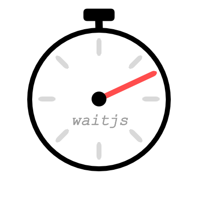

# <div align="center"></div>

The coolest way to wait
[](https://travis-ci.org/KamiKillertO/waitjs)

waitjs provides you a promise-like interface to manage postponed executions.

Instead of writing :

```javascript
function delayedFn() {
    ...
};
setTimeout(delayedFn, 500);
```

 You can now write:

 ```javascript
 function delayedFn() {
     ...
 };
 wait(500).then(delayedFn);
 ```

## API

### wait(time)

## License

MIT
